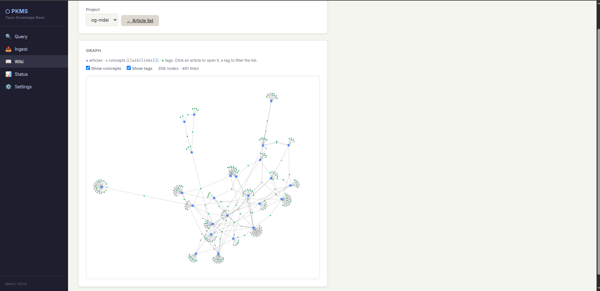
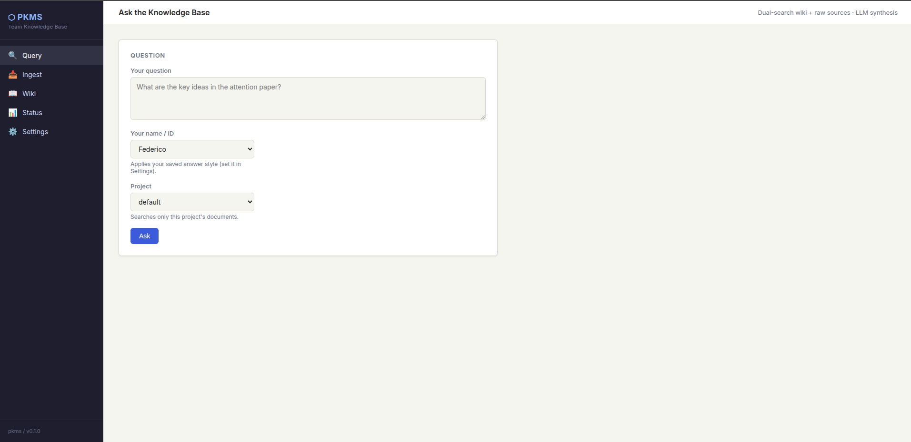
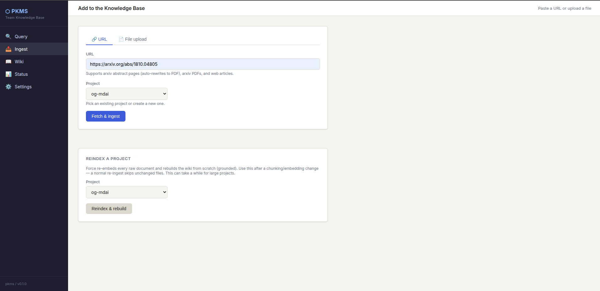
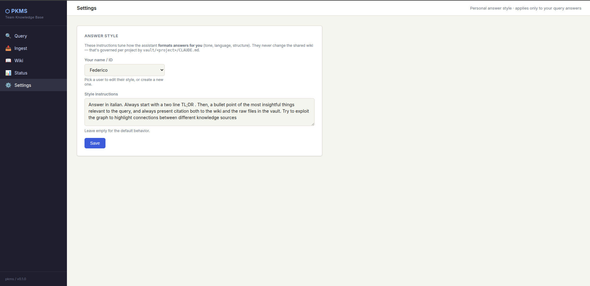

# WikiForge AI

**Knowledge base auto-compilata con LLM locali e cloud, per team R&D.**

WikiForge AI ribalta il modo in cui un team gestisce la propria conoscenza: invece
di *cercare* dentro una pila di documenti, li **compila**. I documenti grezzi (PDF,
HTML, Markdown, note) sono il codice sorgente; un LLM è il compilatore; il risultato
è una **wiki navigabile in Markdown**, con cross-link automatici, versionata in git e
sempre riconducibile alle sue fonti. Poi la si interroga in linguaggio naturale: le
risposte citano le fonti e, se la wiki non copre l'argomento, lo dichiarano invece di
inventare.

Ispirato all'idea di "LLM-compiled wiki" di Andrej Karpathy, esteso dal singolo
utente al **team**: progetti multipli, agenti con permessi separati, concorrenza
gestita, interfaccia web condivisa.


*Il grafo navigabile della conoscenza: articoli, concetti e tag interconnessi,
generato automaticamente dai `[[wikilink]]` compilati.*

---

## Come funziona

```
  DROP            INGEST                COMPILE               INTERROGA
  drop un   →  parsing, chunking   →  l'LLM scrive gli   →  domande in linguaggio
  file nel      semantico, embed       articoli wiki dai      naturale, ricerca
  vault         locali, dedup          chunk reali +          duale (wiki + fonti),
  (o un URL)    a doppio hash          cross-link + git       risposta con citazioni
```

- **Local-first, cloud quando serve.** Embedding e modelli piccoli girano in locale
  su CPU con [Ollama](https://ollama.com); i compiti pesanti si instradano verso
  Claude o Groq. Un unico router decide, per-agente, con fallback automatico.
- **Grounding by design.** Il testo di ogni chunk viaggia nel payload vettoriale: gli
  articoli sono scritti dal contenuto reale delle fonti, non allucinati dai titoli.
- **Documenti lunghi a piacere.** La compilazione è limitata su *entrambi* i lati
  dell'LLM: mappatura-riduzione delle fonti in ingresso, e generazione **sezione per
  sezione** in uscita. Così anche una tesi da 200 pagine diventa un articolo *completo*,
  senza troncamenti — pure su modelli locali o free tier.
- **Estrazione robusta.** Fallback PDF quando l'estrattore incolla le parole; estrazione
  del contenuto principale dalle pagine HTML (via nav, boilerplate e JavaScript).
- **Provenance + audit.** Ogni articolo dichiara le fonti; rimuovere una fonte ne pulisce
  wiki, indice, vettori e link entranti. Un linter opzionale usa un LLM per segnalare
  contraddizioni, incoerenze e articoli-stub.
- **Zero framework agentici.** Pipeline + blackboard + locking su primitive standard
  (FastAPI, httpx, qdrant-client, SQLite). ~5.700 righe di Python, oltre 400 test.

---

## Requisiti

- Python 3.12+ e [uv](https://docs.astral.sh/uv/)
- Docker + Docker Compose (per Qdrant e Ollama)
- ~32 GB RAM consigliati per i modelli locali quantizzati (CPU-only supportato)
- (Opzionale) una API key per un backend LLM cloud — vedi **Configurare il provider LLM**

## Avvio rapido

```bash
# 1. dipendenze
uv sync

# 2. servizi (Qdrant + Ollama + pull dei modelli)
docker compose up -d

# 3. chiavi (opzionali) — vedi sotto quali servono in base al routing scelto
cp .env.example .env      # e compila ciò che ti serve

# 4. watcher + web UI
uv run pkms watch &
uv run pkms serve         # http://localhost:8000

# 5. …oppure tutto in un colpo solo
./scripts/start.sh        # avvia da sé docker compose, watcher e web UI su :8000
```

Poi aggiungi un documento in `vault/<progetto>/raw/` — trascinandolo, importandolo
dal filesystem o incollandone l'URL nella UI: viene ingerito, compilato e reso
interrogabile automaticamente.

### Chiavi API (`.env`)

Di quali chiavi hai bisogno **dipende da come instradi gli agenti** (vedi sotto) e
dal provider di memoria. Copia `.env.example` in `.env` e compila solo ciò che ti
serve — ogni placeholder è documentato lì.

| Chiave | Quando serve | Dove ottenerla |
|--------|--------------|----------------|
| *(nessuna)* | tutti gli agenti su `ollama` + `memory.provider: none` → **zero chiavi**, tutto locale | — |
| `ANTHROPIC_API_KEY` | se un qualsiasi agente è instradato su `claude` | [console.anthropic.com](https://console.anthropic.com) |
| `GROQ_API_KEY` | se un qualsiasi agente è instradato su `groq` (**è il default** per compiler e querier) | [console.groq.com/keys](https://console.groq.com/keys) |
| `MEM0_API_KEY` | solo se `memory.provider: mem0` | [app.mem0.ai](https://app.mem0.ai) |

> **Nota:** la configurazione di default instrada compiler e querier su `groq`, quindi
> "out of the box" serve `GROQ_API_KEY`. Se preferisci partire **senza alcuna chiave**,
> reinstrada quei due agenti su `ollama` (locale) — vedi sotto. Le chiavi vanno nel
> file `.env` (git-ignorato), mai nel codice o nella config versionata.

---

## Configurare il provider LLM

Il cuore personalizzabile di WikiForge AI è il **router LLM**: **ogni agente** della
pipeline può usare un backend diverso, deciso da una singola sezione di
`pkms.config.yaml`. Nessuna riga di codice da toccare.

```yaml
llm_router:
  agents:
    coordinator: ollama    # classificazione intento (solo path API)
    ingestor:    ollama    # estrazione metadati
    compiler:    groq      # scrittura/aggiornamento articoli
    querier:     groq      # sintesi delle risposte
    linter:      claude    # (futuro; oggi rule-based)
  fallback:
    claude: ollama         # se un backend è irraggiungibile, ripiega su...
    ollama: claude
    groq:   ollama
  models:
    claude: claude-sonnet-4-6
    ollama: mistral:7b
    groq:   qwen/qwen3.6-27b
  claude_max_retries: 8
```

Per cambiare provider a un agente: imposti `agents.<agente>: <backend>`, ti assicuri
che esista `models.<backend>` e fornisci la relativa chiave. Fine.

### Backend supportati e loro compatibilità

| Backend  | Come | Chiave richiesta | Note di compatibilità |
|----------|------|------------------|-----------------------|
| **`ollama`** | server locale HTTP (`:11434`) | nessuna | Zero-costo, CPU-only. Fornito da `docker compose`. I modelli vanno "pullati" (il compose lo fa: `mistral:7b`, `nomic-embed-text`). Ideale come default e come fallback. |
| **`claude`** | Anthropic SDK | `ANTHROPIC_API_KEY` | Onora il `Retry-After` del server sui rate limit (`claude_max_retries`). Qualità elevata per articoli durevoli. |
| **`groq`** | endpoint OpenAI-compatible | `GROQ_API_KEY` | Molto veloce. Il free tier ha limiti di token al minuto: il compiler usa un map-reduce gerarchico per restare sotto i tetti per-richiesta. I modelli *hybrid-thinking* (es. `qwen3.6`) sono gestiti automaticamente dal router in modalità non-thinking, così l'output resta parsabile. |

Il router applica una policy di retry uniforme (solo errori transienti, con rispetto
del `Retry-After`) e un fail-fast sugli errori di credito, su tutti i backend.

### Aggiungere un nuovo backend

I backend sono un registro in `pkms/llm.py` (`_BACKENDS`): per aggiungerne uno, si
scrive una funzione `_call_<nome>(prompt, system, config, …)` che ritorna la stringa
di completamento, la si registra nel dizionario e si aggiunge un `models.<nome>` in
config. Gli agenti possono poi puntarci come qualsiasi altro backend.

### Embeddings (nota importante)

Gli **embedding sono separati** dai modelli di generazione e passano sempre da Ollama
(`ollama.models.embedding`, default `nomic-embed-text`, **768 dimensioni**). Le
collezioni Qdrant sono create a 768-dim con distanza coseno: se cambi il modello di
embedding, mantieni la stessa dimensione o ricrea le collezioni, altrimenti
l'indicizzazione fallirà per mismatch dimensionale.

---

## Memoria del motore di query (configurabile)

Il Querier può ricordare le interazioni passate per trasformare la ricerca in
un'indagine cumulativa. Anche il backend di memoria è **pluggable**, via
`memory.provider` in `pkms.config.yaml`:

| Provider | Cosa | Richiede |
|----------|------|----------|
| `none` | nessuna memoria (default) | — |
| `mem0` | memoria gestita ([app.mem0.ai](https://app.mem0.ai)) | `MEM0_API_KEY` + SDK `mem0` |
| `amem` | Zettelkasten locale (SQLite) | `numpy` |
| `mempalace` | memoria spaziale | `pip install '.[mempalace]'` |

Ogni provider implementa lo stesso contratto `recall()` / `store()`, così sostituirlo
non tocca il Querier. Le precondizioni (chiave, SDK) sono validate all'avvio: un
provider mal configurato lo dichiara con un errore, non degrada in silenzio.

---

## Interfacce

- **Web UI** (FastAPI + HTMX): query, ingest (con stream di avanzamento live via SSE),
  browser della wiki con backlink, filtro per tag e **grafo dei link** navigabile,
  impostazioni per-utente, "trasforma una risposta in nota".
- **CLI**: `pkms ingest | compile | query | lint | watch | serve`, con `--project`.

| Interroga | Ingest |
|---|---|
|  |  |

Le risposte applicano lo **stile personale** di ciascun utente (tono, lingua,
struttura) senza mai alterare la wiki condivisa:



La wiki è Markdown puro con `[[wikilink]]` risolvibili, quindi apribile anche in
Obsidian come vista di sola lettura — ma la web UI (col suo grafo) è la superficie
primaria.

---

## Struttura del progetto

```
pkms/
├── web.py           # FastAPI + UI (query, ingest SSE, wiki browser + grafo)
├── compiler.py      # articoli wiki dai chunk, cross-link, map-reduce
├── coordinator.py   # orchestrazione, lock, CLI
├── ingestor.py      # parsing, chunking semantico, dedup a doppio hash
├── querier.py       # ricerca duale wiki+raw + sintesi con citazioni
├── linter.py        # audit qualità wiki (read-only)
├── llm.py           # router 3-backend (claude/ollama/groq) + retry
├── memory.py        # provider di memoria pluggable
├── embed.py         # embedding Ollama batch
├── qdrant_store.py  # store vettoriale
├── db.py            # SQLite: file, provenance, migrazioni
├── graph.py         # grafo dei link della wiki (cache mtime)
├── guards.py        # confini di scrittura per-agente
├── lock.py          # lock per-progetto su SQLite
└── metrics.py       # osservabilità (token, latenza per fase)
```

## Test

```bash
uv run pytest
```

## Licenza

Vedi [LICENSE](LICENSE).
